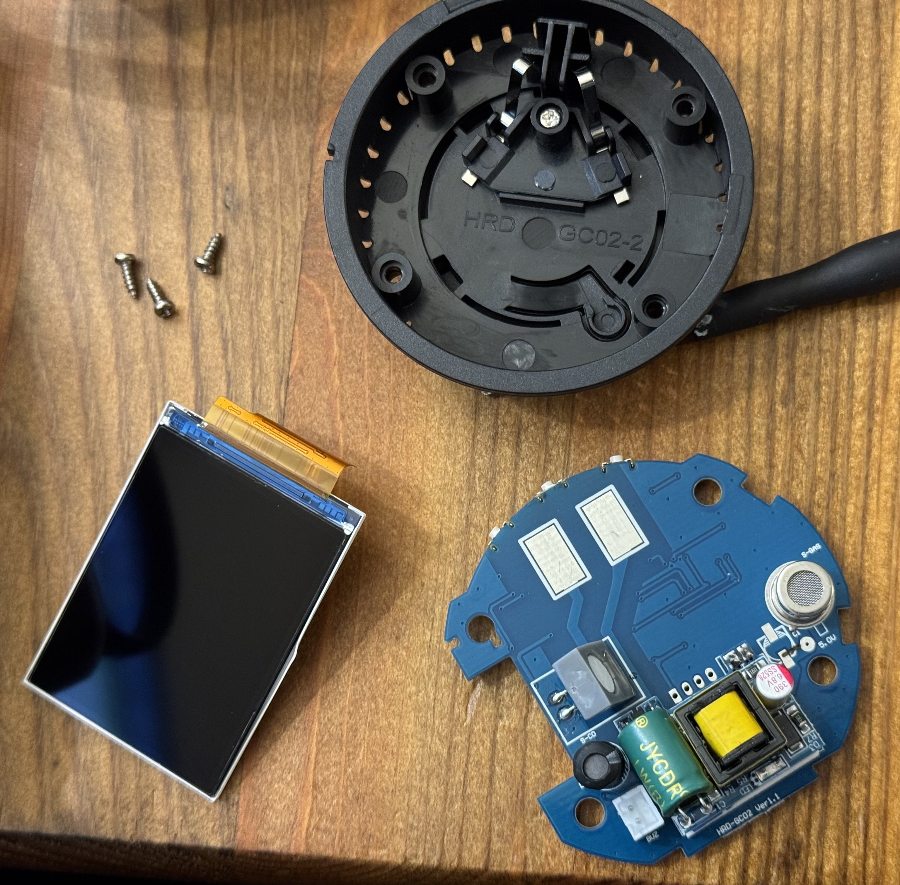
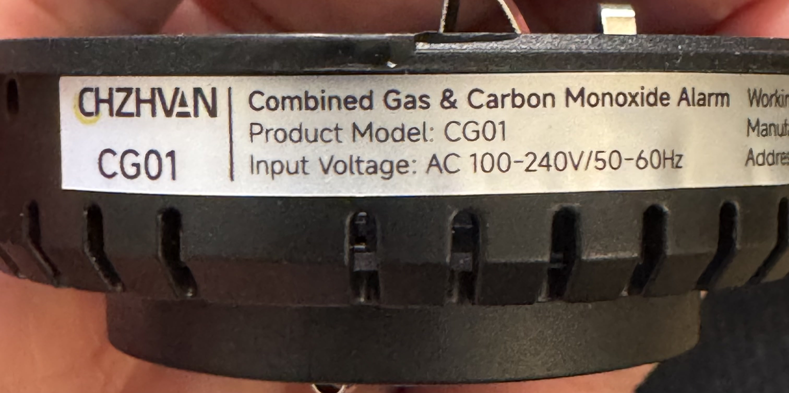
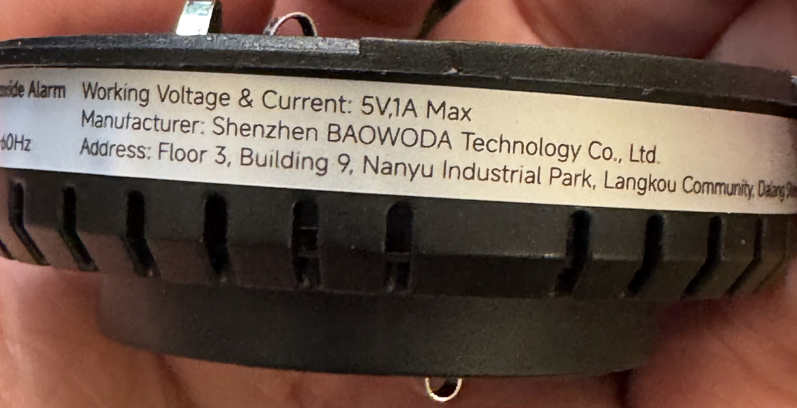
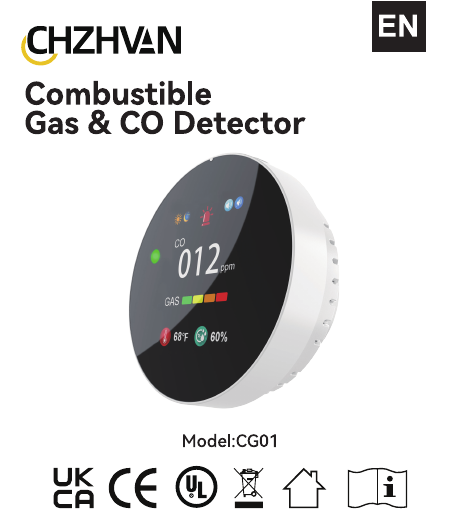
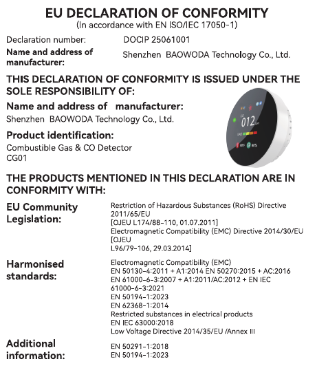
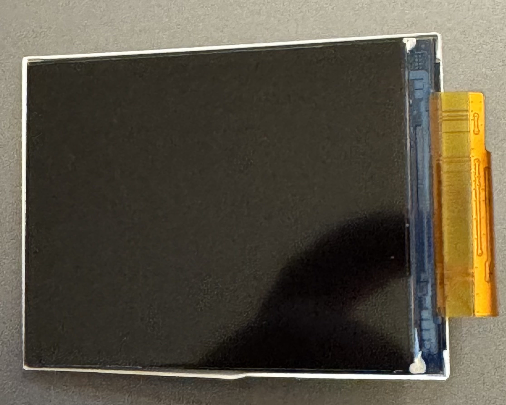
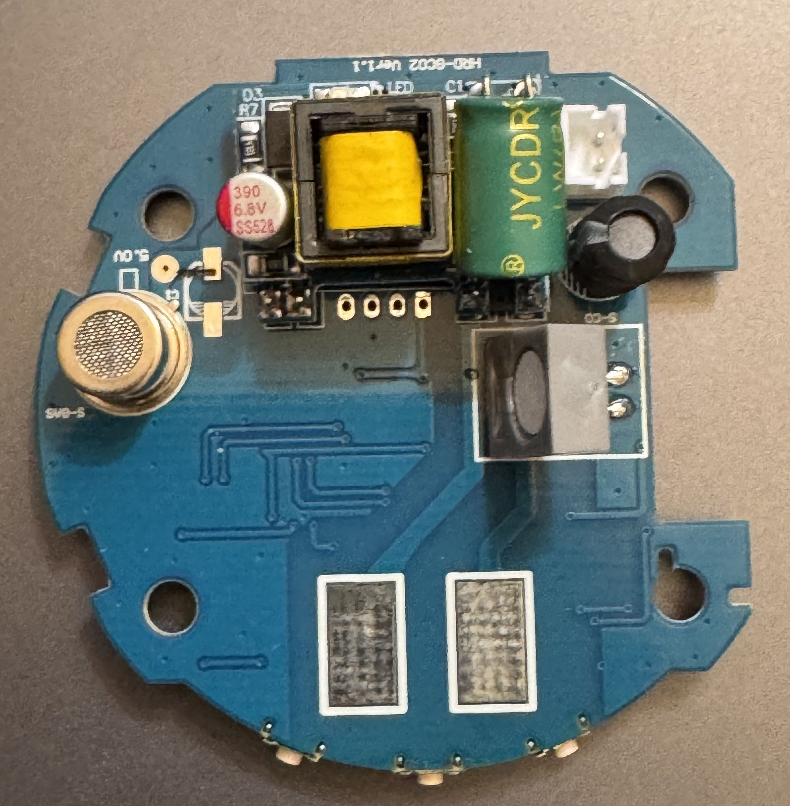
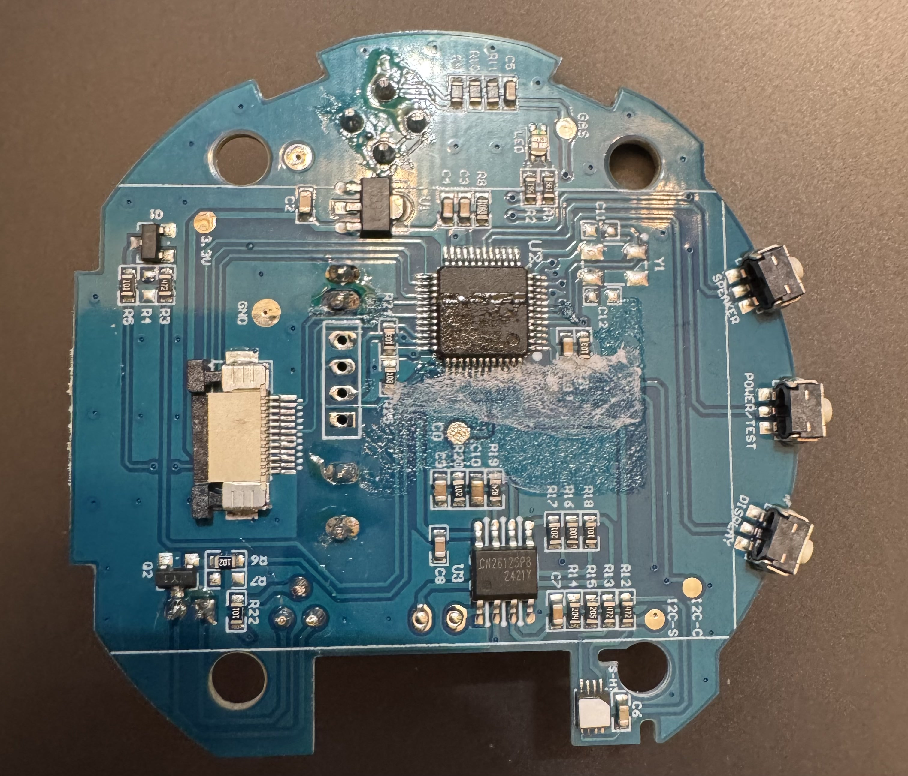
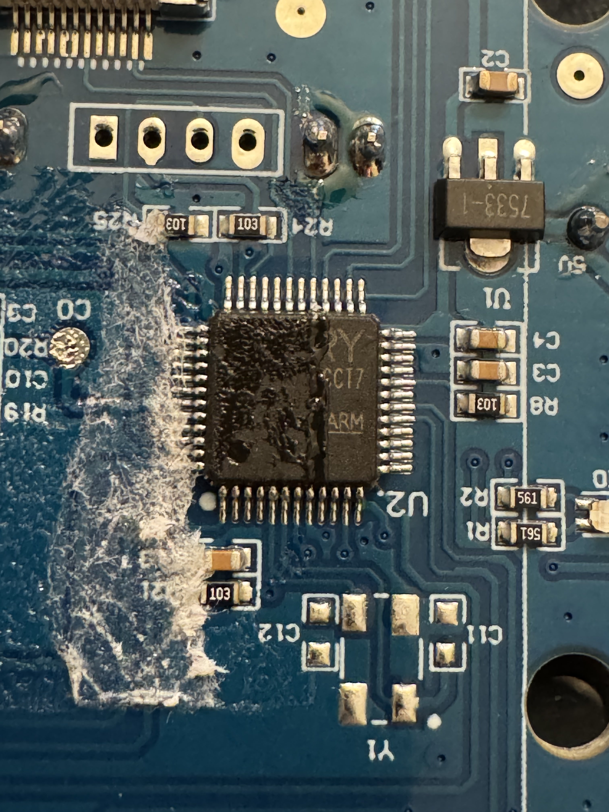

# CHZHVAN CG01 Gas Meter Teardown

> please enjoy this teardown of this interesting CG01 gas meter. I was impressed at the full color screen and wanted to do a quick teardown of it in order to evaluate what possibilities it might have for becoming a wireless home sensor. it appears that there is a 4 pin, potentially UART connection to be made here, but I haven't yet done any firmware dump. I've used codex and gemini to do a bit more analysis and organization of the teardown and photos. there isn't much room in the case for an additional wifi component and I'm a bit concerned with the fact that  mains voltage is wired directly on the same board as the low voltage components. further testing/development will likely include a separate 5 volt power source and skip the wall plug altogether. also, not pictured is the speaker which i removed directly after opening. this device is probably not reliable enough to act as a primary carbon monoxide sensor anyways

This repository is a teardown and research note for the CHZHVAN CG01, a low-cost plug-in "Combined Gas & Carbon Monoxide Alarm" sold as a roughly $20-30 multi-gas detector. The device is interesting because it combines a small full-color screen, a compact round mains-powered enclosure, a single circular PCB, and a likely factory/debug header near the microcontroller.

The important caveat: this teardown does not validate alarm accuracy. The visible design raises enough questions that I would treat this unit as an unverified supplemental indicator unless and until it is tested with calibrated gas and traceable reports. Use certified carbon monoxide alarms from reputable manufacturers for life-safety coverage.



## Current Status

- Firmware dump: not attempted.
- Gas-response testing: not attempted.
- Debug header pinout: not confirmed.
- Exact MCU part number: not confirmed.
- Exact gas-sensor part number: not readable from the supplied photos.
- Speaker/buzzer: removed immediately after opening and not shown in the teardown photos.
- Manual PDF: uploaded in this repository at [assets/manuals/chzhvan-cg01-manual.pdf](assets/manuals/chzhvan-cg01-manual.pdf).

## Device Identity

The retail device is labeled CHZHVAN CG01. The inner shell and PCB also carry HRD-GC02 markings, tying it to a related HRD-GC02 design family.





Observed identifiers:

| Field | Observed value |
| --- | --- |
| Front/label brand | CHZHVAN |
| Product model | CG01 |
| Label description | Combined Gas & Carbon Monoxide Alarm |
| Manual description | Combustible Gas & CO Detector |
| Label input voltage | AC 100-240 V, 50-60 Hz |
| Label working voltage/current | 5 V / 1 A max |
| Manufacturer on label/manual | Shenzhen BAOWODA Technology Co., Ltd. |
| Label address, partial | Floor 3, Building 9, Nanyu Industrial Park, Langkou Community, Dalang... |
| PCB marking | `HRD-GC02 Ver:1.1` |
| Inner plastic shell marking | `HRD GC02-2` |
| EU DoC number from manual | DOCIP 25061001 |
| Certificate number from manual | LGT25E152C01 |
| DoC issue date shown in manual | 2025-06-15 |

The BAOWODA, CHZHVAN, and HRD-GC02 names should be treated as a likely product/OEM/design-family cluster rather than proof that every public record refers to the exact same retail SKU.

## Design-Publication Context

The HRD-GC02 marking matches a related Chinese appearance-design publication for a "Methane and Carbon Monoxide Alarm (HRD-GC02)." That record is useful because it connects the HRD-GC02 name to the same physical product class and shape.

| Field | Value |
| --- | --- |
| Title | Methane and Carbon Monoxide Alarm (HRD-GC02) |
| Publication number | CN309611093S |
| Application number | 202530119920.4 |
| Application date | 2025-03-13 |
| Publication date | 2025-11-18 |
| Applicant / patentee | Shenzhen Huerdun Technology Co., Ltd. |
| Designer | Guo Zhihua |
| Main classification | 10-05 |
| Agency | Guangdong Shenke Law Firm |
| Agent | Wu Jun |
| Address | Room 305, Building G, No. 62, Puxia Road, Liuyue North Community, Henggang Street, Longgang District, Shenzhen, Guangdong Province, 518000, China |
| Key design feature | Shape |
| Best representative view | Perspective view 1 |

## Manuals And Product Links

Uploaded local manual:

- [Local repository copy: CHZHVAN CG01 manual PDF](assets/manuals/chzhvan-cg01-manual.pdf)

External manuals and product pages:

- [Manuals.plus PDF 1](https://manuals.plus/m/8d3ae95211ce29aa4cd40857e15c04374e0e1ad29cb9e1e3573d071be3636ebb.pdf)
- [Manuals.plus PDF 2](https://manuals.plus/m/a9fce58f3bb8f634b40b0ca3a2581a542f50115a1a8de5016d965f432112a3ad.pdf)
- [Manuals.plus PDF 3](https://manuals.plus/m/899777f4e84a9016b76af7b2c6e4fcfb5102312d0254f2d464ec3424154c0093.pdf)
- [Amazon-hosted CG01 manual / Declaration of Conformity](https://m.media-amazon.com/images/I/C1qErKdaQPL.pdf?ref=dp_product_quick_view)
- [AliExpress listing](https://www.aliexpress.us/item/3256809830015016.html?gatewayAdapt=glo2usa4itemAdapt)
- [ILOTUT patent-index page for HRD-GC02](https://www.ilotut.com/intlBusiness/patent/detail/691db56bfb7c4f7500733a68.html)

The uploaded PDF copy is byte-identical to the Amazon-hosted CG01 manual I was able to fetch during this update. Its SHA-256 is:

```text
a9fce58f3bb8f634b40b0ca3a2581a542f50115a1a8de5016d965f432112a3ad
```

Manual cover and declaration excerpt:





## Manual-Derived Specs

The English section of the manual gives these working specs:

| Spec | Manual value |
| --- | --- |
| Housing size | 65 mm diameter, 23 mm thick |
| Product power | Less than 3 W |
| Sensor life | 5 years |
| Preheat / warm-up | About 180 seconds before normal monitoring |
| LPG / combustible gas range | 0-8000 ppm |
| CO range | 0-999 ppm |
| Temperature display range | 0-100 deg C / 32-212 deg F |
| Relative humidity range | 0-99% RH |
| Use environment | -10 deg C to 55 deg C, less than 95% RH, no condensation |
| Alarm method | Sound and light alarm with LCD display |
| Alarm volume | Greater than 85 dB |
| Combustible-gas alarm point | More than 3000 ppm gas / more than 6% LEL |
| Combustible-gas alarm response | Within 30 seconds above threshold |
| CO alarm threshold statement | Alarm when CO is over 300 ppm |

The manual's combustible gas bar thresholds are:

| Display zone | Gas concentration |
| --- | --- |
| Green | Less than 1000 ppm, below 2% LEL |
| Yellow | 1000-2000 ppm, 2-4% LEL |
| Orange | 2000-3000 ppm, 4-6% LEL |
| Red / alarm region | More than 3000 ppm, above 6% LEL |

The manual's CO response table is:

| CO level | Response time |
| --- | --- |
| 27 +/- 3 ppm | No alarm before / response after more than 120 min |
| 55 +/- 5 ppm | Alarm within 60-90 min |
| 110 +/- 10 ppm | Alarm within 10-40 min |
| 330 +/- 30 ppm | Alarm within 3 min |

One manual inconsistency is worth noting. One page says the unit enters normal monitoring after about 180 seconds. Another warning says the detector has no detection function during a preheating period that lasts 60 seconds. I would assume there is an initial warm-up period and verify actual alarm readiness empirically rather than relying on either sentence alone.

The manual also says temperature and humidity readings can be biased by heat generated inside the AC-powered unit. That matters if the device is repurposed as a home sensor.

## Mechanical Teardown

The CG01 is a round puck-style plastic plug-in alarm with a black front lens and vented perimeter. The main PCB is circular and sits behind the display/front lens. The display is a separate rectangular module connected by a flat flex cable.

| Feature | Observation |
| --- | --- |
| Case form | Round plug-in puck |
| Vents | Perimeter vents |
| Face | Black display/lens area |
| Internal plastic marking | `HRD GC02-2` |
| Main PCB retention | Screws into plastic standoffs |
| Sensor exposure | Sensor positioned near vented edge |
| Display mounting | Separate LCD module behind the front lens |
| Backup power | No visible battery in supplied photos |

There is very little spare room for an added ESP8266/ESP32-class module. A wireless bridge inside the same mains-powered case would also be harder to debug safely and may make RF performance worse.

## Display

The display is a small color TFT with a flat-flex cable. It is not a segmented LCD.



The UI shown in the manual includes CO ppm, combustible-gas bars, temperature, humidity, screen-brightness status, alarm status, and several status icons. The display is one of the nicest parts of the device relative to its price.

## Buttons And User Interface

The board has three side tactile switches:

| Button marking | Likely function |
| --- | --- |
| `SPEAKER` | Silence / mute / buzzer control |
| `POWER/TEST` | Power and alarm self-test |
| `DISP/F` / display button | Display brightness or temperature unit control |

The manual says short/long presses handle buzzer mute, temperature unit switching, self-test, power-off, and brightness changes.

## Placement Caveat

A combined methane/LPG/CO alarm is inherently placement-compromised:

- Methane / natural gas rises.
- LPG / propane tends to sink.
- CO alarm placement is normally chosen around rooms, sleeping areas, and occupied levels.

A single plug-in wall location cannot be ideal for all of those hazards. That does not automatically mean the CG01 is useless, but it is a structural limitation of the product category.

## Electronics Architecture

Reconstructed block diagram:

```text
AC 100-240 V input
        |
        v
small offline AC/DC supply
(yellow transformer + mains-side support parts)
        |
        v
~5 V low-voltage rail
        |
        +--> gas sensor heater / alarm loads / LEDs
        |
        v
U1: 7533-1 regulator
        |
        v
3.3 V logic rail
        |
        +--> U2: Puya-like / generic Arm MCU
        |       +--> LCD module / LCD interface
        |       +--> three side buttons
        |       +--> buzzer / speaker output
        |       +--> gas-sensor analog input
        |       +--> LED / icon outputs
        |       +--> test / programming pads
        |
        +--> U3 / support IC, not identified
```



Visible functional blocks:

| Block | Evidence | Confidence |
| --- | --- | --- |
| Offline AC/DC supply | Yellow transformer, electrolytics, power-section layout | High |
| 5 V rail | Label says 5 V / 1 A max; low-voltage output components visible | Medium |
| 3.3 V logic rail | SOT-89 regulator marked `7533-1`; board has `3.3V` marking | High |
| MCU | LQFP chip with `ARM` and Puya-like `PY`/`Y` visible | Medium-high |
| Gas sensor | Metal mesh can near perimeter vents | Medium |
| LCD/UI | FPC connector and separate display module | High |
| Buttons | Three labeled tactile switches | High |
| Buzzer/speaker path | Manual function and button marking; speaker removed before photos | Medium |
| Debug/programming pads | Four through-hole pads near MCU | Medium |
| U3 support IC | SOIC-8 package, exact part unresolved | Low |

## Power Supply And Safety Caveats

The board places a mains-derived power supply and low-voltage logic on the same compact PCB. That is normal for a plug-in device, but it makes teardown and development risky.

Visible power-related parts include:

| Part | Likely role | Notes |
| --- | --- | --- |
| Yellow transformer | Isolated or semi-isolated offline AC/DC converter element | Exact topology requires tracing |
| Green film capacitor marked `JYCDR` | EMI, snubber, or supply-related film capacitor | Exact function requires tracing |
| Electrolytic marked `390 6.3V` | Low-voltage bulk/output capacitor | Near supply output area |
| Additional black electrolytic | Rail filtering | Exact rail unknown |
| `U1` marked `7533-1` | 3.3 V LDO regulator | Likely powers MCU and logic |
| White connector | Internal connection | Exact function unclear from photos |

The `7533-1` marking is consistent with an HT7533-1-style 3.3 V LDO regulator. That supports, but does not prove, a 3.3 V MCU/debug interface.

This teardown did not verify:

- Fuse presence or rating.
- MOV/surge protection.
- Thermal-fuse protection.
- Creepage and clearance distances.
- Transformer safety approvals.
- Isolation barrier integrity.
- Enclosure flame rating.
- Leakage current.
- Hi-pot / dielectric withstand performance.

Do not power this board outside the enclosure from mains. Do not connect a USB UART, SWD probe, oscilloscope, grounded logic analyzer, or laptop to the board while it is plugged into the wall.

## MCU, Firmware, And Debug Header





The earlier automated visual identification suggested an Artery/AT32-class ARM microcontroller. The newer supplied analysis and the visible `PY`/`ARM`-like markings are more consistent with a Puya-family or Puya-like Arm MCU. The exact part number remains unresolved because the package marking is partly obscured by residue and photo angle.

The MCU likely handles:

- Warm-up / preheat timing.
- Gas-sensor heater timing or steady drive.
- ADC sampling of the gas sensor divider/output.
- Baseline compensation.
- Alarm threshold comparison.
- CO response-time logic.
- Display updates.
- Buzzer and LED driving.
- Button debouncing.
- Test, silence, display, and power modes.
- Fault-state handling.

The 4-pad header near the MCU is the most interesting future interface. It could be UART, SWD, factory programming, fixture test, or some combination of power/ground/data pins. A plausible header could include:

- 3.3 V.
- GND.
- SWDIO or UART TX/RX.
- SWCLK or a second UART line.

That is a hypothesis, not a pinout.

Suggested debug workflow:

1. Keep the device disconnected from mains.
2. Identify board ground using continuity to the LDO ground and low-voltage ground pours.
3. Identify the 3.3 V rail at the LDO output.
4. Map each 4-pad header pin to ground, 3.3 V, MCU pins, reset, or test points.
5. Power the low-voltage side from a current-limited isolated bench supply only after confirming the expected injection point.
6. Watch candidate data pins with a 3.3 V logic analyzer during boot for UART output at common baud rates.
7. If the pinout looks like SWD, try a CMSIS-DAP, J-Link, or ST-Link style probe with OpenOCD only after confirming voltage and ground.
8. Attempt firmware readout only after confirming the debug interface and accepting that readout protection may be enabled.

## Sensor Subsystem

The board has one obvious gas sensor: a small cylindrical metal-can component with a mesh cap, placed near the perimeter venting.

The package style is consistent with a compact heated semiconductor / metal-oxide gas sensor or related multi-gas sensor package. The exact part number is not readable from these photos.

Why that matters:

- Common CO detectors often use electrochemical cells.
- Metal-oxide gas sensors can respond to multiple gases and VOCs.
- Heated semiconductor sensors can be sensitive to humidity, temperature, aging, and baseline drift.
- A single visible sensor for both combustible gas and CO increases reliance on compensation and firmware logic.

No calibrated gas testing was done, and no hidden underside electrochemical CO cell is visible in the supplied photos. The sensor architecture therefore remains a major open question.

## U3 And Other Unknowns

The small SOIC-8 `U3` support IC was not identified. The marking is difficult to read from the available photos and may be something like `CM2612SP8` / `2421Y`, but that should be rechecked under a microscope.

Possible roles for U3 include:

- Analog front-end or amplifier.
- EEPROM or calibration memory.
- Power-management support.
- Display or sensor-support logic.

Do not assume its function until the traces are mapped.

## Build-Quality Observations

| Area | Observation | Comment |
| --- | --- | --- |
| MCU region | Visible residue/coating/fibers over chip and traces | Could be flux, glue, conformal coating, or process residue; it obscures inspection |
| Sensor/power solder joints | Some joints appear fluxy or discolored | Needs microscope inspection; not enough to declare a failure |
| PCB layout | Compact, single-board design | Cost-optimized consumer construction |
| Power and logic on same PCB | Expected for plug-in device | Isolation boundary must be physically verified |
| Sensor placement | Sensor near side vents | Sensible for exposure, but placement remains gas-type-compromised |
| Backup power | No visible battery | Concern for CO alarm use during power loss |
| Labeling | Full manufacturer name and partial address visible | Better than many generic low-cost devices |

## Compliance And Certification Context

The manual/declaration page lists Shenzhen BAOWODA Technology Co., Ltd., CG01, and a declaration number. It also lists standards and EU legislation categories, including RoHS, EMC, low-voltage, EN 50291-1:2018, and EN 50194-1:2023.

A CE Declaration of Conformity is generally a manufacturer responsibility. The manufacturer identifies applicable legislation, performs conformity assessment, compiles technical documentation, signs the declaration, and affixes CE marking. There is not a single central EU database that proves every valid DoC.

Things I would still want before trusting this as a life-safety alarm:

- A test report from an accredited lab for the exact model.
- Confirmation of the applicable CO alarm standard.
- Confirmation of the applicable combustible-gas alarm standard.
- Verification that any UL-style mark maps to a real listing/file for this model.
- Evidence for RV/motorhome claims if marketed for vehicle use.
- Long-term drift and humidity test data.

Brand context note: the provided research points to a 2024 U.S. CPSC recall for a different CHZHVAN product, model JKD-512, due to failure to alert consumers to fire. That recall was not for the CG01, but it is relevant background when evaluating trust in a low-cost life-safety device.

## Why I Would Not Use This As Primary CO Protection

The teardown does not prove the CG01 is defective, but it does show several reasons to be cautious:

- No obvious electrochemical CO cell is visible.
- Only one obvious gas sensor is visible.
- No visible backup battery.
- The manual has a preheat-duration inconsistency.
- Mains power, low-voltage logic, sensor, and UI all share a very compact board.
- The device category has unavoidable placement compromises.
- Public certification evidence was not established from the supplied material.

Recommended posture: treat CG01 readings as hobby telemetry or a supplemental indicator until the exact sensor, calibration method, alarm behavior, and third-party test evidence are verified.

## Wireless Sensor Potential

The CG01 is tempting as a Home Assistant or MQTT sensor because it already has:

- A color screen.
- A sensor front-end.
- Local alarm behavior.
- A microcontroller that may have accessible debug/test pads.
- A compact enclosure.

The same points make it risky. There is not much safe physical room for a wireless module, and heat from the internal supply already affects temperature/humidity readings according to the manual. A separate 5 V supply and bypassing the wall-plug mains path is the cleaner development route.

Practical future paths:

- Use the CG01 as a donor enclosure/display/sensor board, powered from an isolated 5 V source.
- Sniff UART or SWD if the 4-pad header exposes it.
- Leave the original alarm behavior intact and only mirror readings if a serial protocol is found.
- Mount a wireless bridge externally instead of packing it into the round case.
- Treat gas/CO readings as uncalibrated hobby telemetry unless verified against calibrated gas.

## Suggested Test Plan

Electrical safety and power checks:

| Test | Purpose |
| --- | --- |
| Visual creepage/clearance inspection | Verify isolation spacing |
| Transformer and supply part identification | Determine whether safety-rated parts are used |
| Low-voltage rail measurement | Confirm 5 V and 3.3 V rails |
| Current-limited low-voltage injection | Determine whether the board can run without mains |
| Isolation resistance / hi-pot test | Verify the mains isolation barrier |
| Leakage-current test | Check user-accessible leakage |
| Thermal imaging during warm-up and alarm | Find overheating supply, regulator, sensor, or enclosure areas |
| Power-cycling and brownout test | Check startup, fault handling, and alarm recovery |
| Surge/EFT testing | Check mains transient robustness |

Gas-response checks:

Do not use car exhaust, a stove, an open flame, or uncontrolled gas leaks. Use calibrated test gas, regulators, a chamber/fixture, and ventilation.

| Test gas / condition | Expected check |
| --- | --- |
| Clean air baseline | Stable zero / no false alarm after warm-up |
| CO 27 ppm | No alarm before 120 min, per manual table |
| CO 55 ppm | Alarm in 60-90 min, per manual table |
| CO 110 ppm | Alarm in 10-40 min, per manual table |
| CO 330 ppm | Alarm in less than 3 min, per manual table |
| Methane/LPG staged exposure | Display level and alarm near claimed >3000 ppm / >6% LEL |
| High humidity | Verify no false alarms or desensitization |
| VOC/alcohol exposure | Assess cross-sensitivity and nuisance alarms |
| Long-term drift | Monitor baseline and sensitivity over days/weeks |

Firmware/debug checks:

- Identify debug header pins with a multimeter.
- Determine whether SWD or UART is present.
- Read MCU ID if SWD is available.
- Check whether flash readout protection is enabled.
- Monitor ADC inputs and sensor heater drive.
- Monitor display and alarm outputs.
- Test fault detection by safely simulating sensor open/short conditions.

## Component Map

| Location / clue | Visible marking or feature | Likely role |
| --- | --- | --- |
| Top power section | Yellow transformer, film capacitor, electrolytics | Offline AC/DC supply |
| Near power output | `7533-1` SOT-89 | 3.3 V regulator |
| Left/front edge | Metal mesh-can sensor | Gas sensor |
| Center/rear | LQFP `PY` / `ARM`-like MCU | Main controller |
| Lower rear | SOIC-8 `U3`, marking unclear | Unknown support IC |
| Side edge | `SPEAKER`, `POWER/TEST`, `DISP/F` switches | UI controls |
| Display connector | FPC connector | TFT module connection |
| Through-hole pad row | Four unpopulated pads | Debug, programming, or factory test |
| Board/case | `HRD-GC02` markings | Design family |

## Open Questions

1. What is the exact MCU part number?
2. What is the exact gas-sensor part number?
3. Is there a hidden or underside CO electrochemical cell not visible in the supplied photos?
4. What is `U3`?
5. Is the power-supply transformer safety-certified?
6. What are the measured creepage/clearance distances across the mains isolation boundary?
7. Is the UL-style mark in the manual associated with a real listing/file for this exact model?
8. Are there accredited test reports for EN 50291-1 and EN 50194-1?
9. Does the unit meet alarm timing after sensor aging and humidity exposure?
10. Does this model have any battery-backup variant, or is it mains-only?
11. Is the 4-pad header UART, SWD, or factory-only test?
12. Can readings be extracted digitally without disturbing original alarm behavior?
13. Does the device store calibration data in flash or an external support IC?

## Safety Notes

- Do not probe this board while it is plugged into mains.
- Do not connect grounded test gear to the board unless it is powered from a safe isolated source.
- Do not assume the low-voltage side is safe just because the MCU probably uses 3.3 V logic.
- Do not rely on this teardown or this device as a primary CO safety system.
- Keep certified CO and gas alarms installed separately.

## References

- [Local repository copy: CHZHVAN CG01 manual PDF](assets/manuals/chzhvan-cg01-manual.pdf)
- [Manuals.plus PDF 1](https://manuals.plus/m/8d3ae95211ce29aa4cd40857e15c04374e0e1ad29cb9e1e3573d071be3636ebb.pdf)
- [Manuals.plus PDF 2](https://manuals.plus/m/a9fce58f3bb8f634b40b0ca3a2581a542f50115a1a8de5016d965f432112a3ad.pdf)
- [Manuals.plus PDF 3](https://manuals.plus/m/899777f4e84a9016b76af7b2c6e4fcfb5102312d0254f2d464ec3424154c0093.pdf)
- [Amazon-hosted CG01 manual / Declaration of Conformity](https://m.media-amazon.com/images/I/C1qErKdaQPL.pdf?ref=dp_product_quick_view)
- [AliExpress listing](https://www.aliexpress.us/item/3256809830015016.html?gatewayAdapt=glo2usa4itemAdapt)
- [ILOTUT patent-index page for HRD-GC02](https://www.ilotut.com/intlBusiness/patent/detail/691db56bfb7c4f7500733a68.html)
- [CPSC recall for a different CHZHVAN JKD-512 smoke/CO detector](https://www.cpsc.gov/Recalls/2024/CHZHVAN-Combination-Smoke-and-Carbon-Monoxide-Detectors-Recalled-Due-to-Failure-to-Alert-to-Fire-Sold-Exclusively-on-Amazon-com-by-Haikouhuidishangmaoyouxiangongsi)
- [EU Your Europe: CE marking](https://europa.eu/youreurope/business/product-requirements/labels-markings/ce-marking/index_en.htm)
- [EU Your Europe: Signing a Declaration of Conformity](https://europa.eu/youreurope/business/product-requirements/compliance/signing-declaration-conformity/index_en.htm)
- [NIST: How do carbon monoxide detectors work?](https://www.nist.gov/how-do-you-measure-it/how-do-carbon-monoxide-detectors-work)
- [EPA: What about carbon monoxide detectors?](https://www.epa.gov/indoor-air-quality-iaq/what-about-carbon-monoxide-detectors)
- [CPSC: Carbon Monoxide Questions and Answers](https://www.cpsc.gov/Safety-Education/Safety-Education-Centers/Carbon-Monoxide-Information-Center/Carbon-Monoxide-Questions-and-Answers)

## Repository Contents

- `README.md` is the consolidated teardown writeup.
- `assets/photos/` contains the teardown photos converted from the uploaded HEIC originals to JPEG.
- `assets/manual/` contains small rendered manual excerpts used for identification/context.
- `assets/manuals/chzhvan-cg01-manual.pdf` is the uploaded 37-page CG01 manual PDF.
- The source Markdown notes from `Downloads` are not included as separate files; their useful conclusions were rewritten and integrated here.
